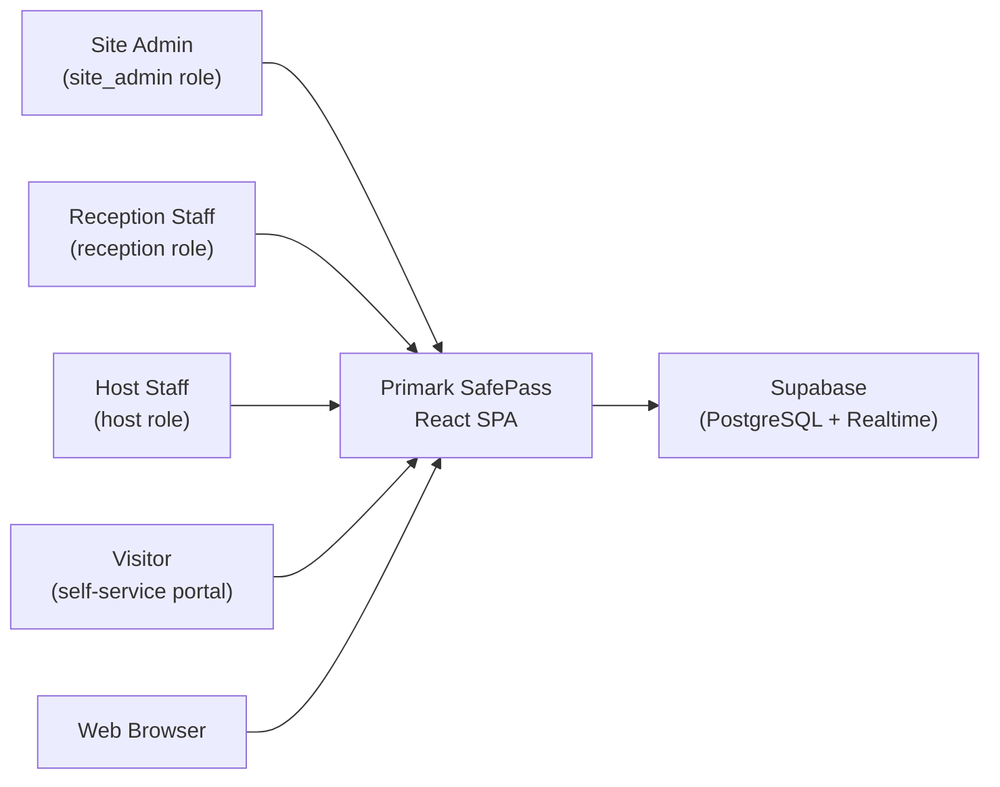
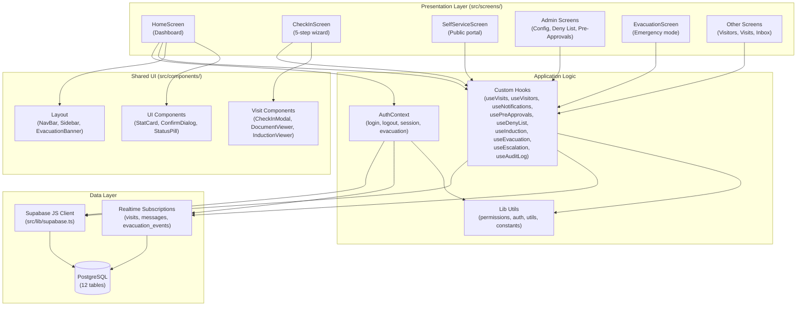
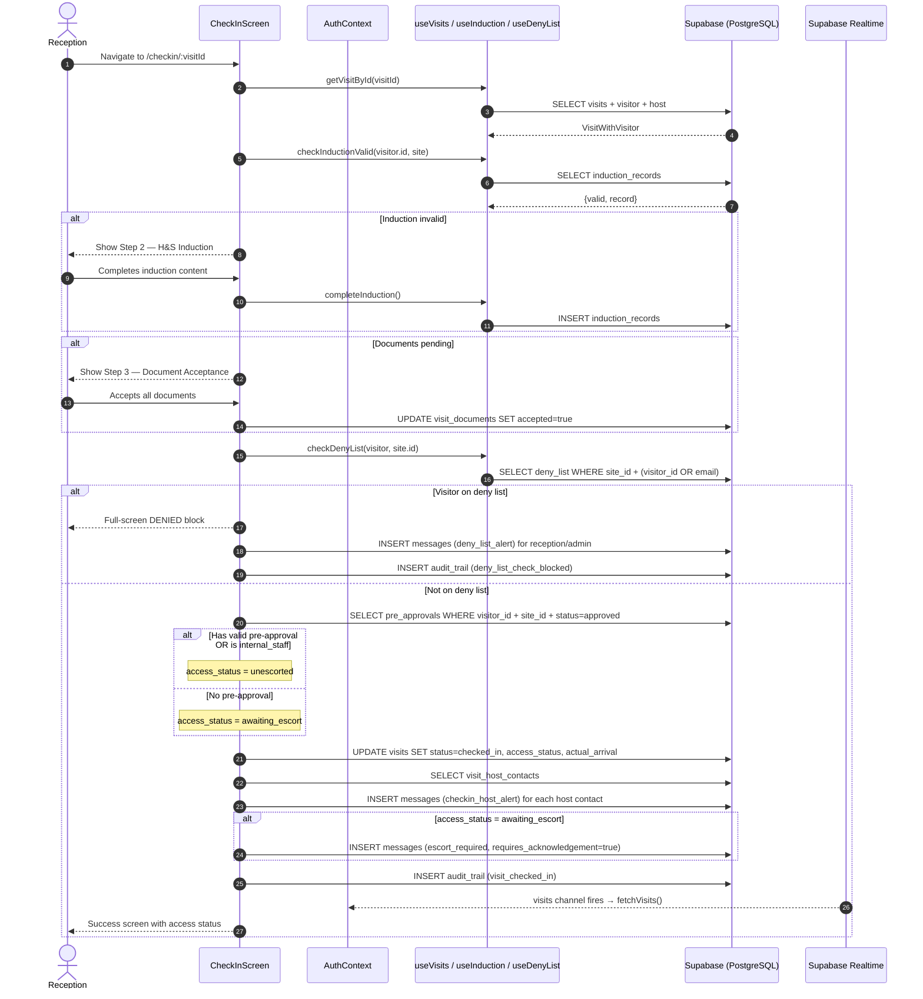
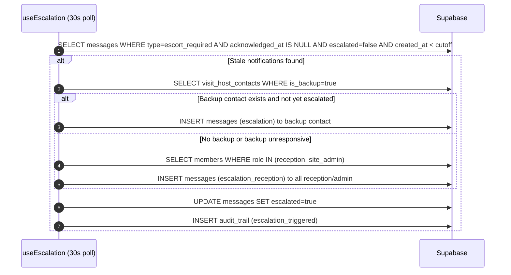

# Architecture — Primark SafePass

**Version:** 1.0
**Date:** 2026-03-04
**Source:** Reverse-engineered from codebase

---

## 1. System Overview

Primark SafePass is a single-page React application (SPA) with no custom API server. All data access, real-time subscriptions, and storage are provided by Supabase (PostgreSQL + Realtime). The frontend is built with React 19, TypeScript, and Tailwind CSS, bundled by Vite.

---

## 2. Tech Stack

| Layer | Technology | Version |
|-------|-----------|---------|
| Frontend framework | React | 19.0.0 |
| Language | TypeScript | 5.7.3 |
| Build tool | Vite | 6.2.0 |
| Routing | React Router DOM | 7.2.0 |
| Styling | Tailwind CSS | 3.4.17 |
| Backend / BaaS | Supabase (PostgreSQL + Realtime) | JS client 2.49.1 |
| Auth | Custom PIN-based (bcryptjs) | bcryptjs 3.0.2 |
| Notifications | react-hot-toast | 2.5.2 |
| Markdown rendering | react-markdown | 9.0.3 |
| Charts | recharts | 2.15.1 |
| Icons | lucide-react | 0.575.0 |

---

## 3. System Context Diagram

---

## 4. Component Diagram

---

## 5. Key Modules

| Module | Location | Responsibility |
|--------|----------|----------------|
| Auth context | `src/context/AuthContext.tsx` | Login/logout, session state, inactivity timer, realtime subscriptions for notifications and evacuation |
| Route configuration | `src/App.tsx` | All client-side routes, `ProtectedLayout` (auth guard), `RoleGuard` (role check) |
| Supabase client | `src/lib/supabase.ts` | Single Supabase client instance shared across all hooks |
| Type definitions | `src/lib/types.ts` | All TypeScript interfaces for database entities and enriched UI types |
| Permissions | `src/lib/permissions.ts` | Role level hierarchy and `hasMinRole()` guard function |
| Auth utilities | `src/lib/auth.ts` | `verifyPin()` and `hashPin()` wrappers around bcryptjs |
| Utilities | `src/lib/utils.ts` | `getDisplayStatus()` (overdue computation), `formatDate()`, `isToday()`, `classNames()` |
| Constants | `src/lib/constants.ts` | `AuditAction`, `AuditEntityType` type unions, `INDUCTION_VALIDITY_DAYS = 28` |
| Visit hook | `src/hooks/useVisits.ts` | Today's visits + checked-in visits, Realtime subscription on `visits` table per site |
| Escalation hook | `src/hooks/useEscalation.ts` | 30-second polling for overdue escort notifications; triggers escalation inserts |
| Audit hook | `src/hooks/useAuditLog.ts` | `log()` wrapper — inserts to `audit_trail` |
| Dashboard | `src/screens/HomeScreen.tsx` | Live status board, stat cards, evacuation trigger |
| Check-in wizard | `src/screens/CheckInScreen.tsx` | 5-step guided check-in with deny-list check and access determination |
| Self-service portal | `src/screens/SelfServiceScreen.tsx` | Token-based public portal for visitors |
| Site configuration | `src/screens/SiteConfigScreen.tsx` | H&S content authoring, notification settings |
| Admin | `src/screens/AdminScreen.tsx` | User management (create, edit, deactivate) |
| Evacuation | `src/screens/EvacuationScreen.tsx` | Full-screen emergency mode with live headcount register |

---

## 6. Data Flow — Visitor Check-In

---

## 7. Data Flow — Escort Escalation

---

## 8. Authentication and Authorisation

### Login Flow
1. User submits username + 4-digit PIN on `LoginScreen`
2. `AuthContext.login()` fetches the `members` row by username (includes `pin_hash`)
3. `verifyPin()` in `src/lib/auth.ts` runs bcrypt comparison against the stored hash
4. On success, `pin_hash` is destructured out of the object — only the `SafeUser` type (which `Omit`s `pin_hash`) is stored in React state
5. The associated `sites` row is fetched and stored in context

### Session Management
- No JWT or cookies — session lives in React state (memory only)
- **Inactivity timer:** 30-minute timeout (`INACTIVITY_TIMEOUT_MS`). Resets on `mousemove`, `keydown`, `click`, `touchstart`. Calls `logout()` on expiry
- Logout clears all context state; a page refresh also requires re-login

### Role Authorisation
- Three roles with numeric levels: `host (1)`, `reception (2)`, `site_admin (3)`
- `hasMinRole(role, required)` in `src/lib/permissions.ts` checks `ROLE_LEVELS[role] >= ROLE_LEVELS[required]`
- Route-level: `RoleGuard` component in `App.tsx` wraps routes requiring elevated access
- Feature-level: `isHost`, `isReception`, `isSiteAdmin` booleans from `useAuth()` gate UI elements

### Public Access
- `/self-service/:token` is fully public — no login required
- Visitor is identified by their `access_token` UUID from the `visitors` table
- A `null` or anonymised visitor record returns an "invalid link" screen

---

## 9. Real-Time Subscriptions

| Channel | Table | Filter | Purpose |
|---------|-------|--------|---------|
| `visits:site:{siteId}` | `visits` | `site_id=eq.{siteId}` | Keeps today's visit list and on-site board live |
| `notifications:user:{userId}` | `messages` | `recipient_user_id=eq.{userId}` | Updates unread notification badge in navbar |
| `evacuation:site:{siteId}` | `evacuation_events` | `site_id=eq.{siteId}` | Detects evacuation activation/closure across all sessions |

Subscriptions are created in `AuthContext` (notifications, evacuation) and `useVisits` (visits). Each subscription is cleaned up on component unmount via `supabase.removeChannel()`.

---

## 10. Deployment and Infrastructure

- **Hosting:** Not specified in codebase. The build output (`dist/`) is a standard static site bundle suitable for Vercel, Netlify, or any CDN
- **Database:** Supabase (managed PostgreSQL). Schema defined in `supabase/schema.sql` and `supabase/indexes.sql`
- **Seed data:** `supabase/seed.ts` — run with `npm run seed`. Requires `VITE_SUPABASE_URL` and `VITE_SUPABASE_ANON_KEY` in `.env`
- **Build:** `npm run build` runs `tsc -b && vite build`. TypeScript strict mode enabled (`noUnusedLocals`, `noUnusedParameters`)
- **Production bundle:** ~688 KB JS, ~21 KB CSS
