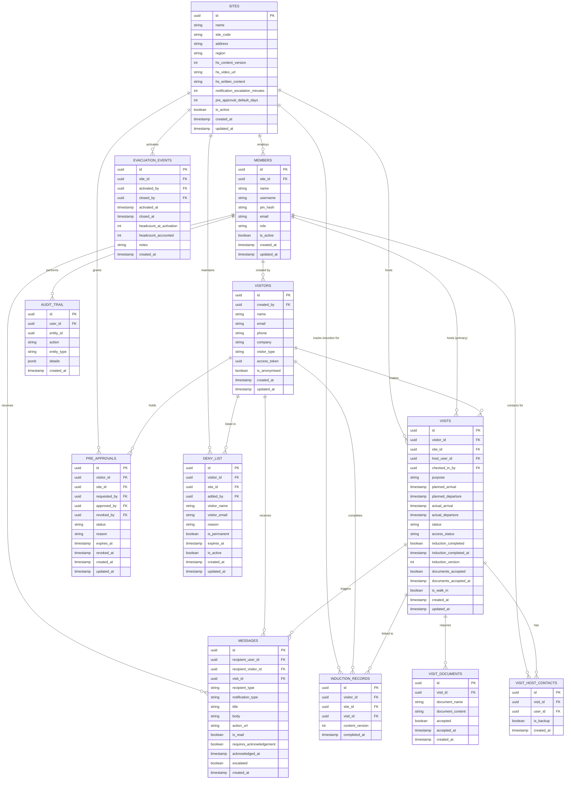

# Data Model — Primark SafePass

**Version:** 1.0
**Date:** 2026-03-04
**Source:** Reverse-engineered from `supabase/schema.sql` and `src/lib/types.ts`

---

## 1. Entity Relationship Diagram

---

## 2. Entities

### SITES

**Table:** `sites`
**Description:** Represents a physical Primark location (store, distribution centre, or office). Each site has its own H&S content, notification settings, and user base.

| Column | Type | Nullable | Description |
|--------|------|----------|-------------|
| `id` | uuid | No | Primary key |
| `name` | text | No | Display name of the site |
| `site_code` | text | No | Unique short code (e.g. `PRK-DUB-01`). Has `UNIQUE` constraint |
| `address` | text | Yes | Physical address |
| `region` | text | Yes | Geographic region grouping |
| `hs_content_version` | int | No | Version counter for H&S induction content. Increments on publish |
| `hs_video_url` | text | Yes | Embedded video URL for safety induction (e.g. YouTube embed link) |
| `hs_written_content` | text | Yes | Markdown-formatted written H&S guidance |
| `notification_escalation_minutes` | int | No | Minutes before an unacknowledged escort notification escalates (default: 10) |
| `pre_approval_default_days` | int | No | Default duration in days for new pre-approvals (default: 90) |
| `is_active` | boolean | No | Whether the site is operational |
| `created_at` | timestamptz | No | Record creation timestamp |
| `updated_at` | timestamptz | No | Last update timestamp |

**Relationships:**
- Has many `MEMBERS` (staff who log in)
- Has many `VISITS`
- Has many `PRE_APPROVALS`, `DENY_LIST` entries, `EVACUATION_EVENTS`, and `INDUCTION_RECORDS`

---

### MEMBERS

**Table:** `members`
**Description:** Staff who can log in to the SafePass system. Includes hosts, reception staff, and site administrators.

| Column | Type | Nullable | Description |
|--------|------|----------|-------------|
| `id` | uuid | No | Primary key |
| `name` | text | No | Full display name |
| `username` | text | No | Login username. Has `UNIQUE` constraint |
| `pin_hash` | text | No | bcrypt hash of the 4-digit PIN. Never stored plain |
| `email` | text | Yes | Optional email address |
| `site_id` | uuid | No | FK to `sites`. User belongs to one site |
| `role` | text | No | `host` \| `reception` \| `site_admin` |
| `is_active` | boolean | No | Soft-delete flag. Inactive users cannot log in |
| `created_at` | timestamptz | No | Record creation timestamp |
| `updated_at` | timestamptz | No | Last update timestamp |

**Role hierarchy:** `host (1) < reception (2) < site_admin (3)`. Enforced in `src/lib/permissions.ts`.

**Relationships:**
- Belongs to one `SITES`
- Has many `VISITS` as host
- Has many `VISIT_HOST_CONTACTS`
- Has many `MESSAGES` (as recipient)

---

### VISITORS

**Table:** `visitors`
**Description:** People who visit the site. Can be Primark internal staff from another location or third-party contractors/suppliers.

| Column | Type | Nullable | Description |
|--------|------|----------|-------------|
| `id` | uuid | No | Primary key |
| `name` | text | No | Full name |
| `email` | text | No | Email address (used for identification) |
| `phone` | text | Yes | Phone number (editable by visitor via self-service) |
| `company` | text | Yes | Company or organisation name |
| `visitor_type` | text | No | `internal_staff` \| `third_party` |
| `access_token` | uuid | No | Auto-generated UUID used in self-service portal URL (`/self-service/:token`) |
| `created_by` | uuid | No | FK to `members`. Who registered the visitor |
| `is_anonymised` | boolean | No | GDPR soft-delete. When true, PII has been removed |
| `created_at` | timestamptz | No | Record creation timestamp |
| `updated_at` | timestamptz | No | Last update timestamp |

**Relationships:**
- Has many `VISITS`
- Has many `INDUCTION_RECORDS`
- Has many `PRE_APPROVALS`
- May appear in `DENY_LIST`

---

### VISITS

**Table:** `visits`
**Description:** A single scheduled or walk-in visit. Tracks the full lifecycle from scheduling through check-in to departure.

| Column | Type | Nullable | Description |
|--------|------|----------|-------------|
| `id` | uuid | No | Primary key |
| `visitor_id` | uuid | No | FK to `visitors` |
| `site_id` | uuid | No | FK to `sites` |
| `host_user_id` | uuid | No | FK to `members`. Primary host |
| `purpose` | text | No | Reason for the visit |
| `planned_arrival` | timestamptz | No | Scheduled arrival time |
| `planned_departure` | timestamptz | No | Scheduled departure time |
| `actual_arrival` | timestamptz | Yes | Recorded on check-in |
| `actual_departure` | timestamptz | Yes | Recorded on sign-out |
| `status` | text | No | `scheduled` \| `checked_in` \| `departed` \| `cancelled` |
| `access_status` | text | Yes | `unescorted` \| `awaiting_escort` \| `escorted` \| null (pre check-in) |
| `induction_completed` | boolean | No | Whether H&S induction is complete for this visit |
| `induction_completed_at` | timestamptz | Yes | When induction was marked complete |
| `induction_version` | int | Yes | H&S content version that was completed |
| `documents_accepted` | boolean | No | Whether all visit documents have been accepted |
| `documents_accepted_at` | timestamptz | Yes | When documents were accepted |
| `is_walk_in` | boolean | No | Whether this visit was created as a walk-in (not pre-scheduled) |
| `checked_in_by` | uuid | Yes | FK to `members`. Who processed the check-in |
| `created_at` | timestamptz | No | Record creation timestamp |
| `updated_at` | timestamptz | No | Last update timestamp |

**Status values:** `scheduled` \| `checked_in` \| `departed` \| `cancelled`

> Note: `overdue` is **never stored**. It is computed at display time by `getDisplayStatus()` in `src/lib/utils.ts`: a visit is overdue when `status = checked_in` and `planned_departure < now()`.

**Relationships:**
- Belongs to one `VISITORS`, `SITES`, and primary `MEMBERS` (host)
- Has many `VISIT_HOST_CONTACTS`, `VISIT_DOCUMENTS`, `MESSAGES`

---

### VISIT_HOST_CONTACTS

**Table:** `visit_host_contacts`
**Description:** One or more staff contacts assigned to a visit. Supports a primary host and an optional backup contact for escalation purposes.

| Column | Type | Nullable | Description |
|--------|------|----------|-------------|
| `id` | uuid | No | Primary key |
| `visit_id` | uuid | No | FK to `visits`. Cascade deletes |
| `user_id` | uuid | No | FK to `members` |
| `is_backup` | boolean | No | True for the escalation backup contact |
| `created_at` | timestamptz | No | Record creation timestamp |

---

### VISIT_DOCUMENTS

**Table:** `visit_documents`
**Description:** Legal or compliance documents (e.g. NDAs) attached to a visit that require visitor acceptance before check-in.

| Column | Type | Nullable | Description |
|--------|------|----------|-------------|
| `id` | uuid | No | Primary key |
| `visit_id` | uuid | No | FK to `visits`. Cascade deletes |
| `document_name` | text | No | Display name (e.g. "NDA") |
| `document_content` | text | No | Full document body in Markdown format |
| `accepted` | boolean | No | Whether the visitor has accepted this document |
| `accepted_at` | timestamptz | Yes | Timestamp of acceptance |
| `created_at` | timestamptz | No | Record creation timestamp |

---

### INDUCTION_RECORDS

**Table:** `induction_records`
**Description:** A record of a visitor completing the H&S induction for a specific site at a specific content version. Used to determine if re-induction is needed on future visits.

| Column | Type | Nullable | Description |
|--------|------|----------|-------------|
| `id` | uuid | No | Primary key |
| `visitor_id` | uuid | No | FK to `visitors`. Cascade deletes |
| `site_id` | uuid | No | FK to `sites` |
| `content_version` | int | No | Version of H&S content that was completed |
| `completed_at` | timestamptz | No | When the induction was completed |
| `visit_id` | uuid | Yes | FK to `visits`. Set to NULL on visit delete |

**Validity rule:** A record is valid if `content_version` matches the site's current `hs_content_version` **and** `completed_at` is within 28 days (constant `INDUCTION_VALIDITY_DAYS` in `src/lib/constants.ts`).

---

### PRE_APPROVALS

**Table:** `pre_approvals`
**Description:** Grants a third-party visitor unescorted access to a site for a defined period. Without a valid pre-approval, third-party visitors are assigned `awaiting_escort` access status at check-in.

| Column | Type | Nullable | Description |
|--------|------|----------|-------------|
| `id` | uuid | No | Primary key |
| `visitor_id` | uuid | No | FK to `visitors`. Cascade deletes |
| `site_id` | uuid | No | FK to `sites` |
| `requested_by` | uuid | No | FK to `members` |
| `approved_by` | uuid | Yes | FK to `members`. Set when approved |
| `status` | text | No | `pending` \| `approved` \| `rejected` \| `expired` \| `revoked` |
| `reason` | text | Yes | Justification for the approval |
| `expires_at` | timestamptz | Yes | When the approval expires |
| `revoked_at` | timestamptz | Yes | When revoked |
| `revoked_by` | uuid | Yes | FK to `members`. Who revoked it |
| `created_at` | timestamptz | No | Record creation timestamp |
| `updated_at` | timestamptz | No | Last update timestamp |

**Status values:** `pending` \| `approved` \| `rejected` \| `expired` \| `revoked`

---

### DENY_LIST

**Table:** `deny_list`
**Description:** Records of visitors who are blocked from entering a site. Checked during the check-in flow; a match triggers a full-screen block and alerts all reception/admin staff.

| Column | Type | Nullable | Description |
|--------|------|----------|-------------|
| `id` | uuid | No | Primary key |
| `visitor_id` | uuid | Yes | FK to `visitors`. Set to NULL on visitor delete |
| `visitor_name` | text | No | Denormalised name (persists even if visitor record is deleted) |
| `visitor_email` | text | Yes | Denormalised email for matching |
| `site_id` | uuid | No | FK to `sites` |
| `reason` | text | No | Reason for denial |
| `is_permanent` | boolean | No | Whether the ban is permanent |
| `expires_at` | timestamptz | Yes | Expiry for temporary bans |
| `added_by` | uuid | No | FK to `members` |
| `is_active` | boolean | No | Whether the entry is currently active |
| `created_at` | timestamptz | No | Record creation timestamp |
| `updated_at` | timestamptz | No | Last update timestamp |

---

### MESSAGES

**Table:** `messages`
**Description:** In-app notification inbox. Serves both staff (members) and visitors. Simulates email for MVP purposes. Supports acknowledgement workflows for escort requests.

| Column | Type | Nullable | Description |
|--------|------|----------|-------------|
| `id` | uuid | No | Primary key |
| `recipient_type` | text | No | `user` \| `visitor` |
| `recipient_user_id` | uuid | Yes | FK to `members`. Set when recipient is staff |
| `recipient_visitor_id` | uuid | Yes | FK to `visitors`. Set when recipient is visitor |
| `visit_id` | uuid | Yes | FK to `visits`. Associated visit (if applicable) |
| `notification_type` | text | No | See Notification Types table below |
| `title` | text | No | Short notification title |
| `body` | text | No | Full notification body |
| `action_url` | text | Yes | Deep-link for self-service actions |
| `is_read` | boolean | No | Whether the message has been read |
| `requires_acknowledgement` | boolean | No | Whether the recipient must explicitly acknowledge |
| `acknowledged_at` | timestamptz | Yes | When acknowledged (for escort flow) |
| `escalated` | boolean | No | Whether this notification has triggered an escalation |
| `created_at` | timestamptz | No | Record creation timestamp |

---

### EVACUATION_EVENTS

**Table:** `evacuation_events`
**Description:** Records an emergency evacuation at a site. While active, check-ins and sign-outs are suspended across all interfaces. The event stores headcount data for the incident report.

| Column | Type | Nullable | Description |
|--------|------|----------|-------------|
| `id` | uuid | No | Primary key |
| `site_id` | uuid | No | FK to `sites` |
| `activated_by` | uuid | No | FK to `members` (site_admin only) |
| `activated_at` | timestamptz | No | When the evacuation was triggered |
| `closed_at` | timestamptz | Yes | When normal operations resumed |
| `closed_by` | uuid | Yes | FK to `members` |
| `headcount_at_activation` | int | No | Number of visitors on-site when activated |
| `headcount_accounted` | int | No | Running count of accounted visitors (updated live) |
| `notes` | text | Yes | Incident notes added when closing |
| `created_at` | timestamptz | No | Record creation timestamp |

---

### AUDIT_TRAIL

**Table:** `audit_trail`
**Description:** Immutable log of all significant system events. Every write operation in the application calls `useAuditLog().log(...)` to record the action.

| Column | Type | Nullable | Description |
|--------|------|----------|-------------|
| `id` | uuid | No | Primary key |
| `action` | text | No | Action type (see `AuditAction` union in `src/lib/constants.ts`) |
| `entity_type` | text | No | Entity category (see `AuditEntityType` union) |
| `entity_id` | uuid | Yes | ID of the affected record |
| `user_id` | uuid | Yes | FK to `members`. Who performed the action |
| `details` | jsonb | Yes | Structured metadata specific to the action |
| `created_at` | timestamptz | No | When the event occurred |

---

## 3. Enumerations and Lookup Values

| Entity | Field | Values |
|--------|-------|--------|
| MEMBERS | role | `host`, `reception`, `site_admin` |
| VISITORS | visitor_type | `internal_staff`, `third_party` |
| VISITS | status | `scheduled`, `checked_in`, `departed`, `cancelled` |
| VISITS | access_status | `unescorted`, `awaiting_escort`, `escorted`, null |
| PRE_APPROVALS | status | `pending`, `approved`, `rejected`, `expired`, `revoked` |
| MESSAGES | recipient_type | `user`, `visitor` |
| MESSAGES | notification_type | `visit_scheduled`, `visit_cancelled`, `visit_amended`, `checkin_host_alert`, `escort_required`, `escalation`, `escalation_reception`, `host_reminder`, `pre_approval_request`, `pre_approval_decision`, `deny_list_alert`, `evacuation_activated`, `walk_in_host_confirm` |

---

## 4. Key Constraints and Rules

- `members.username` must be globally unique (`UNIQUE` constraint)
- `sites.site_code` must be unique across all sites
- `visitors.access_token` is auto-generated (UUID) and used as the self-service portal access key — indexed in `idx_visitors_token`
- Removing a `visit` cascades to: `visit_host_contacts`, `visit_documents`. Sets `induction_records.visit_id` to NULL
- Removing a `visitor` cascades to: `induction_records`, `pre_approvals`. Sets `deny_list.visitor_id` to NULL, `audit_trail.user_id` to NULL
- Induction validity is 28 days AND must match the current `sites.hs_content_version` — whichever invalidates first triggers re-induction
- `audit_trail` records are never deleted — there is no soft-delete or archival mechanism in the current schema
- A `deny_list` entry can match on either `visitor_id` (if visitor record exists) or `visitor_email` (for name-only entries)
- The last active `site_admin` at a site cannot be deactivated (enforced in `AdminScreen`)
