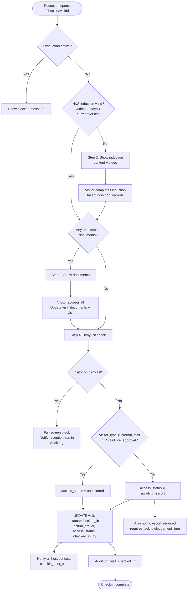
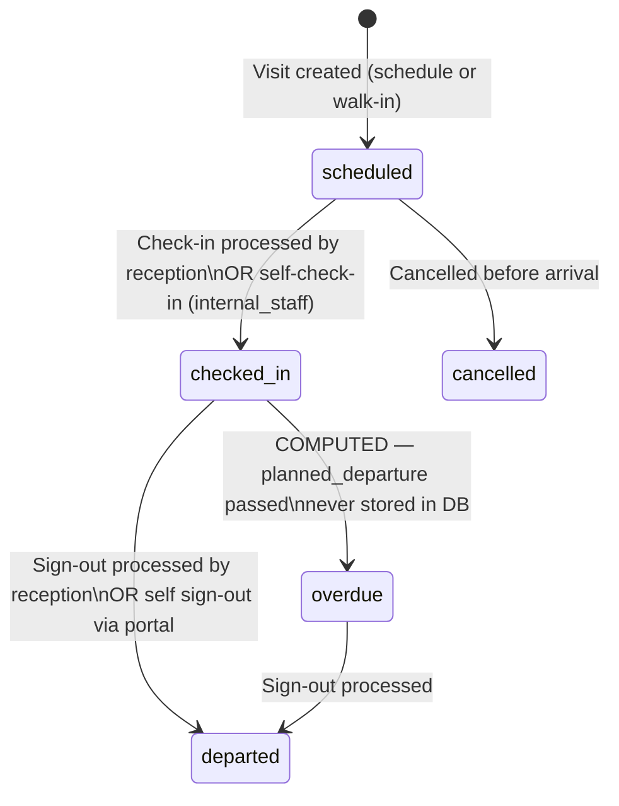
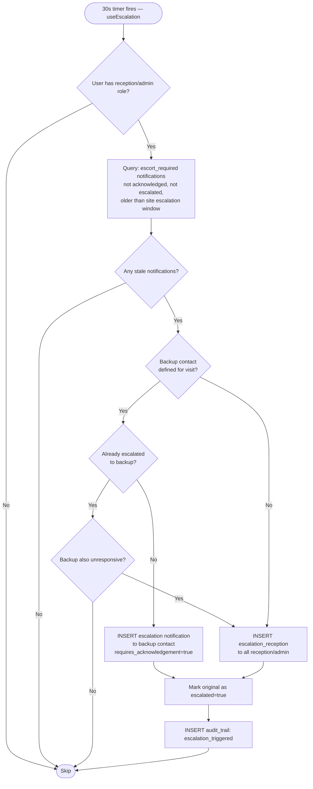
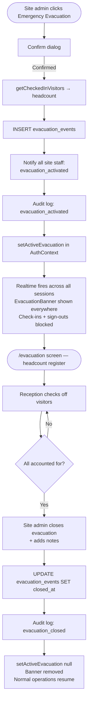
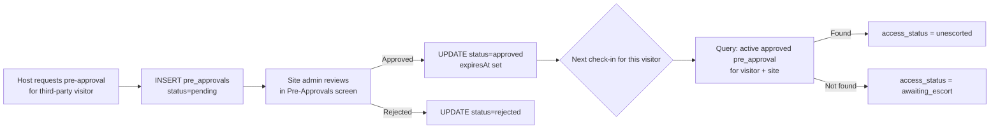

# Technical Design Document — Primark SafePass

**Version:** 1.0
**Date:** 2026-03-04
**Source:** Reverse-engineered from codebase

---

## 1. Purpose

Primark SafePass is a browser-based visitor management system built as an MVP for Primark retail and logistics sites. It digitises visitor registration, enforces H&S compliance at check-in, provides real-time visibility of on-site visitors, and supports emergency evacuation procedures. All persistence, real-time messaging, and authentication are delegated to Supabase, eliminating the need for a custom backend server.

---

## 2. Technical Architecture Decisions

| Decision | Choice | Rationale (inferred) |
|----------|--------|----------------------|
| Frontend framework | React 19 | Component-based UI, rich ecosystem, concurrent rendering features |
| Language | TypeScript (strict) | Type safety; `noUnusedLocals` and `noUnusedParameters` catch dead code at compile time |
| Build tool | Vite | Fast HMR and production builds (~2.5s); ES module–native |
| Backend / BaaS | Supabase (PostgreSQL + Realtime) | Eliminates a custom API server; provides REST, Realtime subscriptions, and hosted PostgreSQL from a single service |
| Auth | Custom 4-digit PIN | Simple, tablet-friendly input; no external IdP dependency for MVP; bcrypt hashing preserves security |
| State management | React Context + custom hooks | No Redux or Zustand; global auth/site/evacuation state in `AuthContext`, domain state co-located in hooks. Appropriate for this scale |
| Routing | React Router DOM v7 | Industry-standard SPA routing with nested route support |
| Styling | Tailwind CSS + custom theme | Utility-first for rapid development; brand colours and component sizing defined in `tailwind.config.js` |
| Markdown rendering | react-markdown | H&S content and visit documents are stored as Markdown in the DB; rendered safely via `MarkdownRenderer` component |
| Overdue status | Computed at runtime | Never stored to avoid stale data — `getDisplayStatus()` in `src/lib/utils.ts` derives it from `status=checked_in` + `planned_departure < now()` |
| Escalation | Client-side polling (30s) | Avoids a server-side cron job; runs only for `reception`/`site_admin` users actively using the app. Acceptable for MVP |
| Charts | recharts | Included for potential analytics; currently used for dashboard stat cards only |

---

## 3. Interface Specification

### No REST API

There are no custom REST API endpoints. All data access uses the **Supabase JavaScript client** (`@supabase/supabase-js`) with direct table queries. This library communicates with Supabase's auto-generated PostgREST API and Realtime WebSocket server.

### Supabase Data Access Pattern

```
src/lib/supabase.ts → createClient(VITE_SUPABASE_URL, VITE_SUPABASE_ANON_KEY)
```

All hooks and screens import `supabase` from this single module. Data access follows these patterns:

| Operation | Pattern |
|-----------|---------|
| Query with joins | `.select('*, visitor:visitors(*), host:members!fkey(*)')` |
| Insert and return | `.insert(payload).select().single()` |
| Update | `.update({...updates, updated_at}).eq('id', id)` |
| Real-time subscribe | `.channel(name).on('postgres_changes', filter, callback).subscribe()` |
| Count query | `.select('id', { count: 'exact', head: true })` |

### Public Route

`GET /self-service/:token` — No authentication. Visitor identified by `visitors.access_token` UUID. If the record does not exist or `is_anonymised = true`, shows an error screen.

---

## 4. Key Workflows

### 4.1 Check-In Wizard



### 4.2 Visit Status Lifecycle



### 4.3 Escort Escalation



### 4.4 Evacuation Flow



### 4.5 Pre-Approval → Unescorted Access



---

## 5. Error Handling

- **User-facing errors:** All async operations wrap failures in `try/catch` and call `toast.error('...')` via `react-hot-toast`. Toasts appear top-right
- **Loading states:** Skeleton placeholder elements (`.skeleton` CSS class) displayed during data fetches
- **Empty states:** `EmptyState` component shown when lists have no results
- **Invalid self-service token:** Shows a dedicated "Link expired or invalid" screen with a `Link2Off` icon
- **Visit not found:** `CheckInScreen` shows a simple "Visit not found" message
- **Form validation:** Inline field-level error messages (shown below inputs) with `text-danger` colour
- **No global error boundary:** Unhandled React errors would result in a blank screen — no `ErrorBoundary` component found in the codebase

---

## 6. Security Considerations

- **PIN storage:** bcrypt hashed (`bcryptjs`). The `pin_hash` field is fetched from Supabase only during login and is immediately discarded after verification — only `SafeUser` (which `Omit`s `pin_hash`) is stored in React state
- **Self-service access:** Token-based (UUID v4). Tokens are not time-limited — the only invalidation is GDPR anonymisation (`is_anonymised = true`). Token rotation is not implemented in the MVP
- **Role guards:** `RoleGuard` component in `src/App.tsx` redirects to `/` if the user's role is insufficient. Feature-level checks use `isHost`, `isReception`, `isSiteAdmin` booleans
- **Row-level security (RLS):** Not visible in schema files — RLS policies may exist in Supabase project settings but are not defined in the checked-in SQL files
- **Input sanitisation:** React's JSX escapes HTML by default. Markdown content is rendered via `react-markdown` which does not execute scripts by default
- **XSS via Markdown:** H&S content and documents are rendered through `MarkdownRenderer`; `react-markdown` does not enable raw HTML by default, so injected `<script>` tags are not executed
- **CORS / API keys:** The Supabase anon key is a public client key. Security relies on Supabase RLS policies (not verified in codebase)
- **Inactivity timeout:** 30-minute automatic logout prevents unattended sessions on shared reception computers

---

## 7. Performance Considerations

- **Supabase indexes** (`supabase/indexes.sql`):
  - `idx_visits_site_status` — fast filtering of active visits by site
  - `idx_visits_site_date` — dashboard date-range queries
  - `idx_visitors_token` — self-service portal token lookup
  - `idx_messages_recipient_user` — unread notification count
  - `idx_deny_list_site` and `idx_deny_list_email` — fast deny-list checks at check-in
  - `idx_evacuation_events_active` (partial index `WHERE closed_at IS NULL`) — active evacuation lookup
- **Realtime subscriptions** replace polling for the dashboard and notification badge, reducing unnecessary queries
- **Escalation uses polling (not Realtime)** — 30-second interval is only active when a reception/admin user is logged in, limiting write frequency
- **Join queries** use Supabase's embedded resource syntax (e.g. `visitor:visitors(*)`) to fetch related data in a single round trip rather than N+1 queries
- **Today's visit filtering** applies `startOfDay`/`endOfDay` bounds client-side to limit the result set
- **State colocation** — hooks hold local state rather than a global store, reducing unnecessary re-renders from unrelated state changes

---

## 8. Known Limitations and Technical Debt

- **No Row-Level Security definitions** in checked-in schema files. The `anon` key has write access to all tables — RLS policies must be configured separately in Supabase to prevent unauthorised direct API calls
- **Escalation is client-dependent** — the 30-second escalation check only runs while a reception/admin user has the app open. If no qualified user is logged in, escalations are delayed until someone opens the app
- **Self-service token is permanent** — there is no token rotation or expiry mechanism. A leaked link remains valid until the visitor is anonymised
- **GDPR request handling is manual** — the portal submits a notification to site admins but does not perform the anonymisation automatically. An admin must navigate to the visitor profile and manually trigger the action
- **`input-base` CSS class** is defined inline in `src/screens/AdminScreen.tsx` (in JSX attribute) rather than as a `@layer components` utility — noted in `MEMORY.md`
- **No error boundary** — unhandled React rendering errors produce a blank screen rather than a graceful degradation
- **Walk-in check-in flow** — the `CheckInScreen` only accepts `visitId` via route param; if walk-in scheduling is done through `ScheduleVisitScreen`, the user must separately navigate to the check-in wizard. No single "schedule and immediately check in" shortcut exists
- **Escalation second-window logic** has a potential bug: `src/hooks/useEscalation.ts:62` compares `alreadyEsc.id` (UUID) as if it were a timestamp to determine the backup escalation cutoff
- **No tests** — no test files found in the repository (no `__tests__`, `*.test.*`, or `*.spec.*` files)

---

## 9. Future Enhancements (identified from code)

- **Email/SMS delivery** — notifications are currently in-app only; the `action_url` field on messages is designed to carry a deep-link for a future external delivery mechanism
- **GDPR automated anonymisation** — the GDPR deletion request currently sends a notification to admins; a direct anonymisation trigger from the visitor portal would remove the manual step
- **Analytics / reporting** — `recharts` is included as a dependency and is partially used; a dedicated reporting screen with visit trends, induction rates, and escort statistics is an obvious extension
- **Role-specific dashboard views** — the dashboard shows different sections based on role, but a more tailored experience per role type could be developed
- **Visitor badge printing** — the evacuation screen already has a print layout; a visitor badge print function at check-in would complement this
- **Token rotation** — self-service access tokens currently never expire; periodic rotation on sign-out would reduce risk from link leakage
- **Multiple sites per user** — the current model assigns each member to exactly one site; cross-site admin capability (beyond the site-admin visit scheduling) is not implemented
